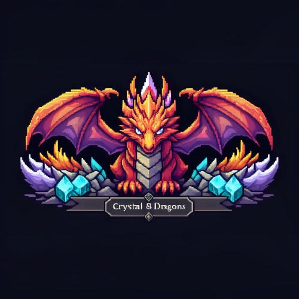
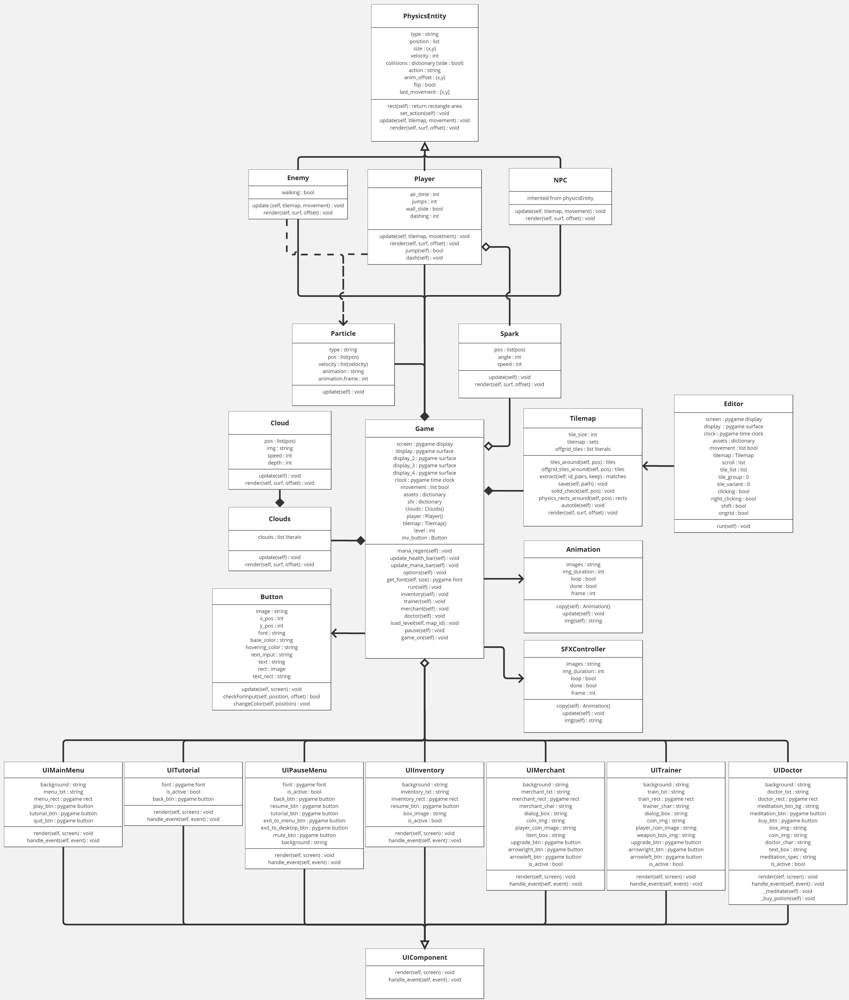
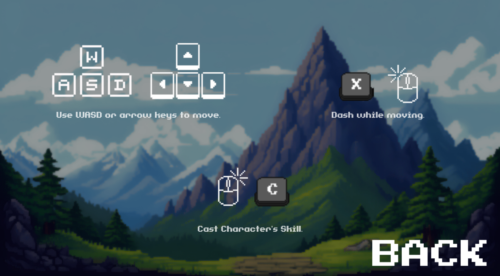
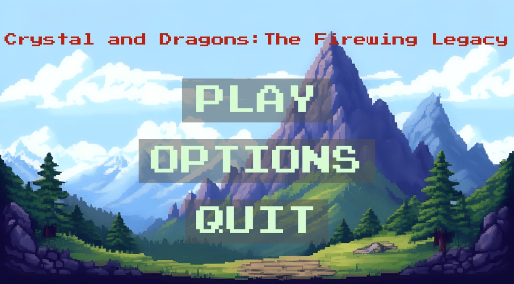

<div align="center">

<h1> Crystal and Dragons: The Firewing Legacy by Chronicle Labs </h1>

Crystal and Dragons: The Firewing Legacy is a Pixelated Role-Playing Game created by Chronicle Labs.

[](#)
[](#)
[](#)
</div>


# Table of Content
[Contributing](#member-of-the-team) <br>
[Introduction Game](#introduction-game) <br>
[Installation Steps](#installation-steps) <br>
[Running the Game with Python](#running-the-game-with-python) <br>
[UML Diagram](#uml-diagram) <br>
[Screenshots](#screenshots) <br>


## Member of the Team
<div align="center">

| Name | NIM | Role | Github |
| :---: | :---: | :---: | :---: |
| Cornelius Linux                   | 122140079 | Project Lead + Programmer                      | [Krossmanzs](https://github.com/Krossmanzs) |
| A. Edwin Krisandika Putra   | 122140003 | Programmer + Designer                          | [aloisiusedwin](https://github.com/aloisiusedwin) |
| Rizki Alfariz Ramadhan       | 122140061 | Programmer + Designer                          | [Alfariz11](https://github.com/Alfariz11)    |
| Abyan King Al Baihaqy       | 122140063 | Programmer + Designer                           | [Binnn05](https://github.com/Binnn05) |
| Aziz Kurniawan                   | 122140097 | Programmer + Designer  | [Aziz097](https://github.com/Aziz097) |
| Raditya Erza Farandi           | 122140209 | Programmer + SFX Designer  | [svernykh](https://github.com/svernykh) |

## Introduction Game
Crystal and Dargons: The Firewing Legacy is a 2 dimentional pixelated Role-Playing Game
that played by 1 player. This game is about exploring fantasy dungeon where the world encountered by players is very different from the ordinary world. This world is filled with various kinds of plants, rocks, and creatures that players don't recognize. These creatures threaten the player's survival where players can fight and overcome every obstacle that exists. Players can collect currency in this game where players can spend it to buy new weapons, upgrade the weapons used and buy potions that can buff player attributes.


## Instalation Steps
<li> Install Python 3.6 or higher</li>
<li> Install python-pip or python3-pip</li>
Open terminal where you want to clone the repository and run the following command:

```
git clone https://github.com/Chronicle-Labs-co/Crystal-and-Dragons-The-Firewing-Legacy.git
cd Crystal-and-Dragons-The-Firewing-Legacy
```


## Running the game with Pygame
<li> Install Python 3.6 or higher</li>
Run the following command to start the game:

```
python3 main.py
```
alternative command:
```
python main.py
```

## UML Diagram


## Screenshots



